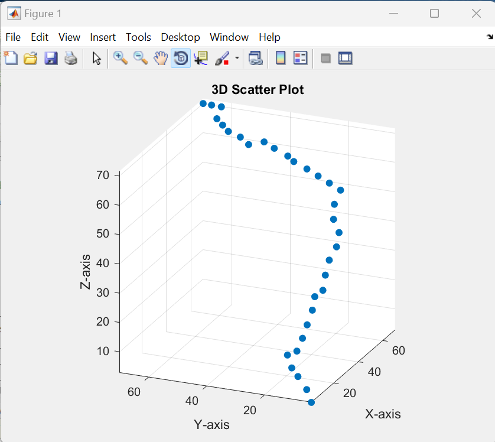

# Path Planning and Optimization

# Introduction
In this repository I have implemented a RRT* algorithm in C++ followed by trajectory optimization in obstacle rich setup.

# How to Run
Clone the repository and run
```
g++ -o main main.cpp RRTStar_withHeader.cpp MinSnapTraj_withHead.cpp
```
Then run
```
./main
```
This will create a outputs.csv file, run this file in MATLAB for visulatization

# Results

Plot of Trajectory



